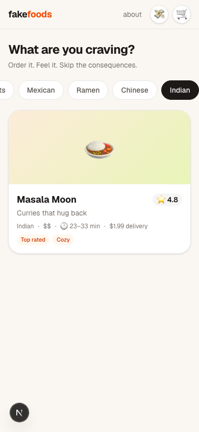
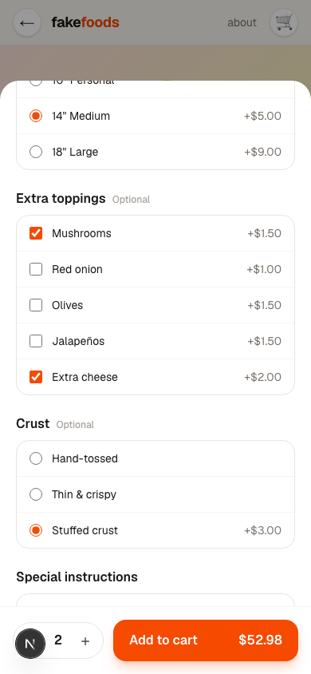
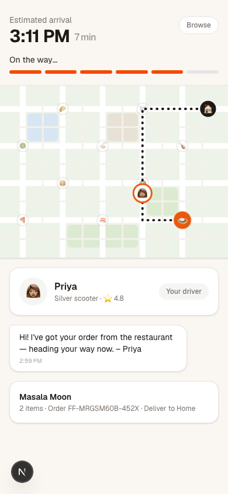
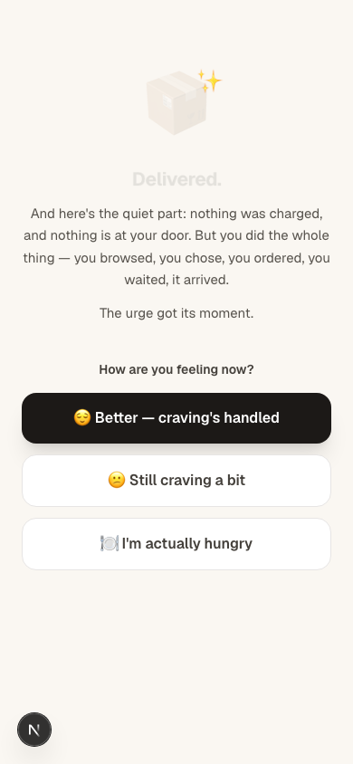
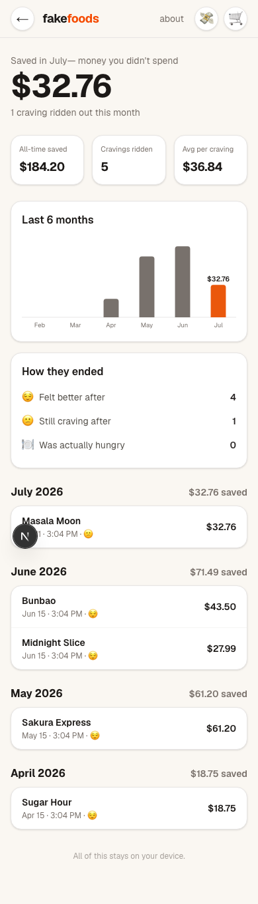
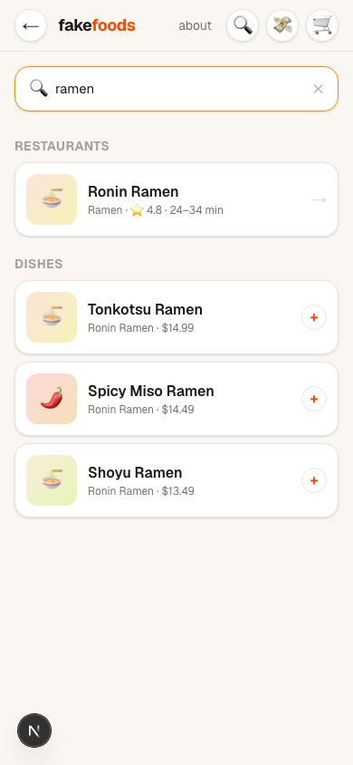

# 🍕 FakeFoods

**Order the feeling, not the food.**

FakeFoods is a fully-functional food delivery app with exactly one catch: **none of it is real.** The restaurants are fictional, the checkout is theater, the driver doesn't exist, and nothing will ever show up at your door.

That's not a bug. That's the entire product.

## Wait, what?

You know that moment. It's 12:47am. You're not hungry — you're bored, or stressed, or your thumb just drifted to the delivery app out of pure muscle memory. Twenty minutes later you're $34 poorer and holding a bag of regret fries.

The thing is, the urge usually isn't about the food. It's about the **ritual**: browsing the menus, building the perfect order, watching the little driver icon crawl across the map. Your brain wants the loop, not the calories.

So FakeFoods gives you the loop. **The whole loop. For free.**

1. 🍜 **Browse** 10 suspiciously appealing fictional restaurants
2. 🛠️ **Customize** your order — size it up, add extra cheese, make it Cluckin' Hot 🔥🔥
3. 🛒 **Cart it** — watch the total tick up with fees, tax, and a tip for a driver who does not exist
4. 💳 **"Pay"** with FakeFoods Pay (balance: plenty) — no money moves, ever
5. 🗺️ **Track your delivery in real time** — live map, moving driver, "I'm outside! 🙌" texts
6. 📦 **It "arrives."** Nothing was charged. Nothing is at your door. The urge got its moment.
7. 💸 **Watch your savings pile up** month after month

And yes — the tracker runs at **real delivery speed** (~20 minutes). Because real urges don't pass in ninety seconds, and riding one out is the whole point.

## Screenshots

| Browse | Customize | Track |
|:---:|:---:|:---:|
|  |  |  |

| The reveal | Your savings | Search |
|:---:|:---:|:---:|
|  |  |  |

## The good stuff

- 🏙️ **A whole fake city** — 10 restaurants (pizza, smash burgers, sushi, ramen, tacos, curries, fried chicken, dessert-only…), each pinned to its own street corner. Your delivery route actually starts from wherever you ordered.
- 🧑‍🦱 **Fake drivers with real charm** — Marcus on his blue e-bike, Priya on the silver scooter. They text you. They're 2 minutes away. They are also not real.
- 🔍 **Search every menu in the city** — dish results deep-link straight into the customization sheet.
- 😌 **A gentle landing** — when the order "arrives," you get a soft check-in, not a lecture. Feeling better? Still craving? Actually hungry? (If you're actually hungry: *go eat real food.* Seriously.)
- 📊 **End-of-month receipts** — every craving you ride out gets logged: what it would have cost, where you "ordered" from, how you felt after. Watch the money-you-didn't-spend chart grow.
- 🔒 **Radically private** — no account, no server, no analytics. Everything lives in your browser's localStorage. Your 1am fake sushi habit is between you and you.

## Running it

```bash
npm install
npm run dev
```

Open [http://localhost:3000](http://localhost:3000), get "hungry," and order absolutely nothing.

Built with Next.js (App Router), React, TypeScript, Tailwind CSS, and Zustand. The delivery map is hand-rolled SVG — no map API, so the whole thing works offline. Delivery progress is a pure function of wall-clock time, so you can close the tab mid-delivery and your fake pad thai will still be making its fake journey when you come back.

## The fine print (the honest part)

- **No payment is ever processed.** There is no payment code in this repo. There is nothing to charge.
- **This is a habit toy, not healthcare.** It doesn't treat eating disorders, anxiety, or anything else. If food is a genuine struggle, please talk to a professional.
- **Hunger is not a craving to be outsmarted.** If your body needs food, close the app and eat. FakeFoods is for the urges that were never about being hungry.

---

*FakeFoods: all of the dopamine, none of the delivery fee.* 🛵💨
